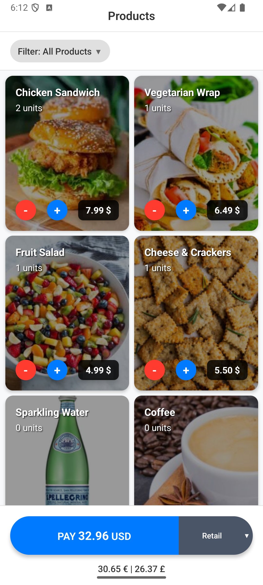
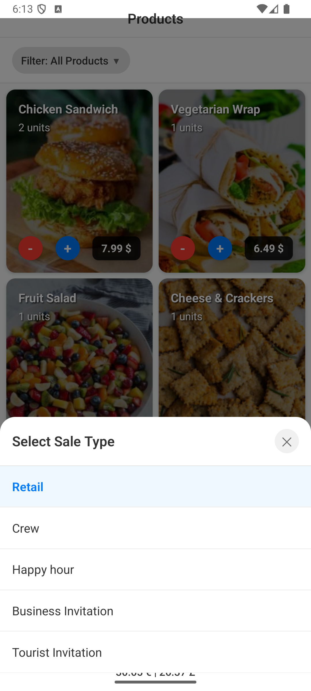
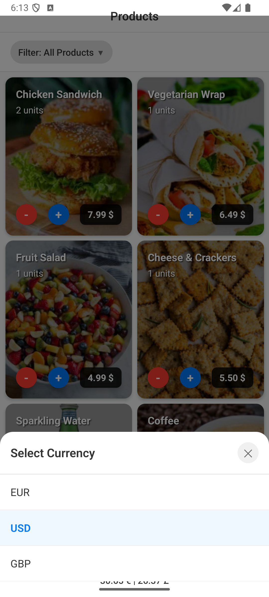
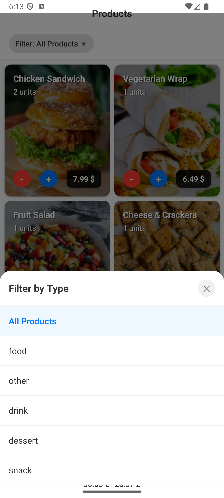
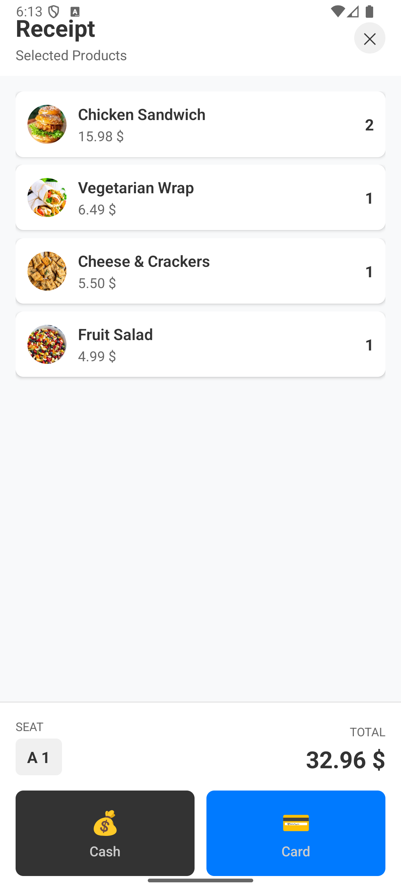
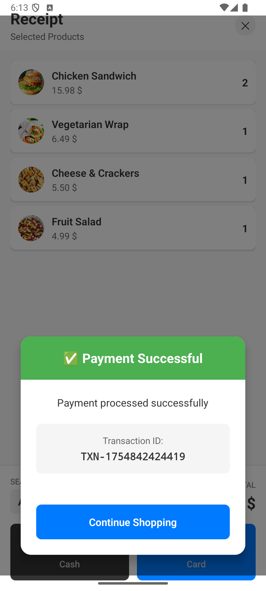

# Products App

A React Native mobile application for managing product sales and payments, designed for flight services. Built with **MVVM (Model-View-ViewModel)** architecture using **MobX** for state management.

## 🏗️ Architecture

This app follows the **MVVM (Model-View-ViewModel)** pattern with the following components:

### 📱 Models (Data Layer)
- **Product.ts** - Product data model with business logic
- **Cart.ts** - Shopping cart model with inventory management  
- **CartItem.ts** - Individual cart item model

### 🧠 ViewModels (Business Logic Layer)
- **ProductSelectionViewModel.ts** - Manages product listing, filtering, and cart operations
- **PaymentViewModel.ts** - Manages payment processing, form validation, and payment flow

### 🎨 Views (UI Layer)
- **ProductSelectionView.tsx** - Product listing and selection interface
- **PaymentView.tsx** - Payment processing interface with original design

### 📦 Store (State Management)
- **AppStore.ts** - Centralized state management
- **AppContext.tsx** - React context for store access

### 🔄 State Management with MobX
The app uses **MobX** for reactive state management:
- `makeAutoObservable()` for automatic reactivity
- `observer()` wrapper for React components
- `runInAction()` for state mutations
- Computed properties for derived state

## 📱 Screenshots

### iOS Screenshots
<p float="left">
  
  
  
  
  
  
  
  
  
  
</p>

### Android Screenshots
<p float="left">
  
  
  
  
  
  
</p>

## 🛠️ Technology Stack

### Core Framework
- **React Native**: `0.80.2`
- **TypeScript**: `5.0.0+`
- **Node.js**: `18.0.0+`

### State Management
- **MobX**: `6.12.0`
- **mobx-react-lite**: `4.0.5`

### Navigation
- **React Navigation**: `6.1.0`
- **@react-navigation/native**: `6.1.0`
- **@react-navigation/stack**: `6.3.0`

### UI Components
- **React Native Gesture Handler**: `2.14.0`
- **React Native Safe Area Context**: `4.8.0`

### Development Tools
- **Metro**: `0.80.2`
- **Babel**: `7.23.0`
- **Jest**: `29.7.0`
- **ESLint**: `8.57.0`

## ✨ Features

### 🛍️ Product Management
- **Product Selection**: Browse and select products from a catalog
- **Shopping Cart**: Add/remove products and manage quantities
- **Stock Management**: Track product inventory
- **Sale Types**: Retail, Crew, Happy Hour, Business Invitation, Tourist Invitation

### 💰 Payment System
- **Multi-Currency Support**: EUR, USD, and GBP with real-time conversion
- **Payment Methods**: Cash and card payment options
- **Form Validation**: Real-time validation for card details
- **Change Calculation**: Automatic change calculation for cash payments
- **Transaction Processing**: Mock API integration with success/error handling

### 🎫 Order Management
- **Seat Assignment**: Assign seats to orders (Row A-Z, Seat 1-50)
- **Receipt Generation**: Detailed order receipts
- **Order History**: Track completed transactions

### 🌍 Internationalization
- **Multi-Language Support**: English UI with Spanish locale handling
- **Currency Formatting**: Proper currency display and conversion
- **Decimal Separator**: Automatic comma-to-period conversion for Spanish locale

## 🚀 Getting Started

### Prerequisites
- Node.js 18.0.0 or higher
- React Native CLI
- Android Studio (for Android development)
- Xcode (for iOS development)

### Installation

1. **Clone the repository**
   ```bash
   git clone <repository-url>
   cd ProductsApp
   ```

2. **Install dependencies**
   ```bash
   npm install
   ```

3. **iOS Setup** (macOS only)
   ```bash
   cd ios
   pod install
   cd ..
   ```

4. **Run the app**
   ```bash
   # iOS
   npm run ios
   
   # Android
   npm run android
   ```

## 📁 Project Structure

```
src/
├── components/          # Reusable UI components
│   ├── ProductCard.tsx
│   └── Dropdown.tsx
├── models/             # Data models (MVVM)
│   ├── Product.ts
│   ├── Cart.ts
│   └── CartItem.ts
├── viewmodels/         # Business logic (MVVM)
│   ├── ProductSelectionViewModel.ts
│   └── PaymentViewModel.ts
├── views/              # UI components (MVVM)
│   ├── ProductSelectionView.tsx
│   └── PaymentView.tsx
├── navigation/         # Navigation configuration
│   └── AppNavigator.tsx
├── services/           # API and external services
│   └── api.ts
├── types/              # TypeScript type definitions
│   └── index.ts
├── utils/              # Utility functions
│   ├── currencyConverter.ts
│   └── discountCalculator.ts
└── contexts/           # React contexts
    └── AppContext.tsx
```

## 🔧 Development

### Running Tests
```bash
npm test
```

### Linting
```bash
npm run lint
```

### Type Checking
```bash
npx tsc --noEmit
```

## 📊 API Integration

The app is designed to work with RESTful APIs and currently uses a fake API server for demonstration purposes.

### 🚀 Fake API Server

This app integrates with a **fake REST API** built using [My JSON Server](https://my-json-server.typicode.com) service:

- **API Repository**: [fakeProductsAPI](https://github.com/rcasanovan/fakeProductsAPI)
- **API Endpoint**: `https://my-json-server.typicode.com/rcasanovan/fakeProductsAPI`
- **Service**: [My JSON Server](https://my-json-server.typicode.com) by Typicode

### 🔗 API Endpoints

The app is designed to work with the following endpoints:
- `GET /products` - Fetch available products
- `POST /payments` - Process payment transactions

### 📋 Data Structure

#### Product Interface
```typescript
interface Product {
  id: string;
  name: string;
  price: number;
  currency: 'EUR' | 'USD' | 'GBP';
  image: string;
  inventory: number;
}
```

#### Payment Interface
```typescript
interface PaymentRequest {
  amount: number;
  currency: string;
  paymentMethod: 'card' | 'cash';
  items: CartItem[];
  cardDetails?: {
    cardNumber: string;
    expiryDate: string;
    cvv: string;
    cardholderName: string;
  };
  cashAmount?: number;
}
```

### 🔧 How It Works

1. **JSON File**: The API uses a `db.json` file hosted on GitHub
2. **Instant Server**: My JSON Server creates a fake REST API from the JSON file
3. **No Registration**: No setup required, just create the JSON file and get instant API access
4. **Caching**: Requests are cached for 1 minute for performance
5. **Public Access**: The API is publicly accessible for demo purposes

### 🎯 Benefits

- **Rapid Prototyping**: No backend setup required
- **Real API Testing**: Test actual HTTP requests and responses
- **Consistent Data**: Same data structure across development and testing
- **Easy Integration**: Standard REST API endpoints
- **No Authentication**: Simple integration for demo purposes

### 🔄 Future Integration

The app is designed to easily switch to a real backend API by simply updating the API service configuration in `src/services/api.ts`.

## 💱 Currency Support

The app supports three currencies with real-time conversion:
- **EUR** (Euro) - Base currency
- **USD** (US Dollar) 
- **GBP** (British Pound)

Exchange rates are currently hardcoded for demo purposes but can be easily replaced with real API calls.

## 🧪 Testing

The app includes comprehensive unit tests:
- Component testing with React Testing Library
- ViewModel testing with MobX
- API service testing
- Utility function testing

## 📱 Platform Support

- **iOS**: 13.0+
- **Android**: API level 21+ (Android 5.0+)

> **⚠️ iOS 18 Compatibility Note**: During development, we encountered compatibility issues with iOS 18 beta versions. The app may experience unexpected behavior or crashes on iOS 18 beta releases. For the best experience, we recommend using iOS 17.x or stable iOS 18 releases when available.

## 📄 License

This project is licensed under the MIT License - see the [LICENSE](LICENSE) file for details.

## 🆘 Support

For support and questions, please open an issue in the repository or contact me directly.
